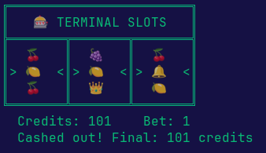

# terminal-slots

A terminal slot machine game.

## Requirements

- Node.js 18+
- Sound requires Linux with `aplay` (ALSA) — ships with most distros. The game runs fine without it.

## Install

```bash
cd terminal-slots
npm install -g .
```

Then run from anywhere:

```bash
terminal-slots
```



## How to play

Press **SPACE** to spin. Each spin costs 1 credit. The three reels stop left to right with a short delay between each.

Only the **center row** scores.

After a win you can:
- **[L]** Let it ride — your winnings become the bet on the next spin
- **[T]** Take payout — winnings are added to your bankroll, bet resets to 1
- **[Q]** Quit and cash out

Press **Q** at any time to quit.

## Payouts

Multiplier wins (× current bet):

| Line | Payout |
|------|--------|
| 👑👑👑 | **Win the entire kitty** |
| 💎💎💎 | 4× bet |
| ⭐⭐⭐ | 3× bet |
| 🍀🍀🍀 | 2× bet |

Flat wins (fixed credits, regardless of bet):

| Line | Payout |
|------|--------|
| 🔔🔔🔔 | +50 |
| 🍓🍓🍓 | +25 |
| 🍇🍇🍇 | +15 |
| 🍉🍉🍉 | +10 |
| 🍊🍊🍊 | +8 |
| 🍒🍒🍒 | +4 |
| Two matching 🍒 / 🍊 in slots 1 & 2 | +5 |
| 🍒 in slot 1 | +2 |
| 🍊 in slot 1 | +1 |

Symbols are weighted — 🍒 is most common, 👑 is rarest.

## The Kitty

Every losing spin adds the bet amount to the kitty (jackpot pool), which starts at 500 and grows without limit. Hit 👑👑👑 to win the entire kitty — it then resets to 100.

## State

Game state is saved to `~/.terminal-slots` after every spin. The game always resumes where you left off. New players start with **100 credits**.
